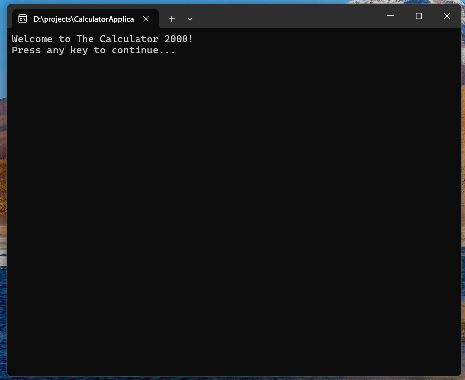
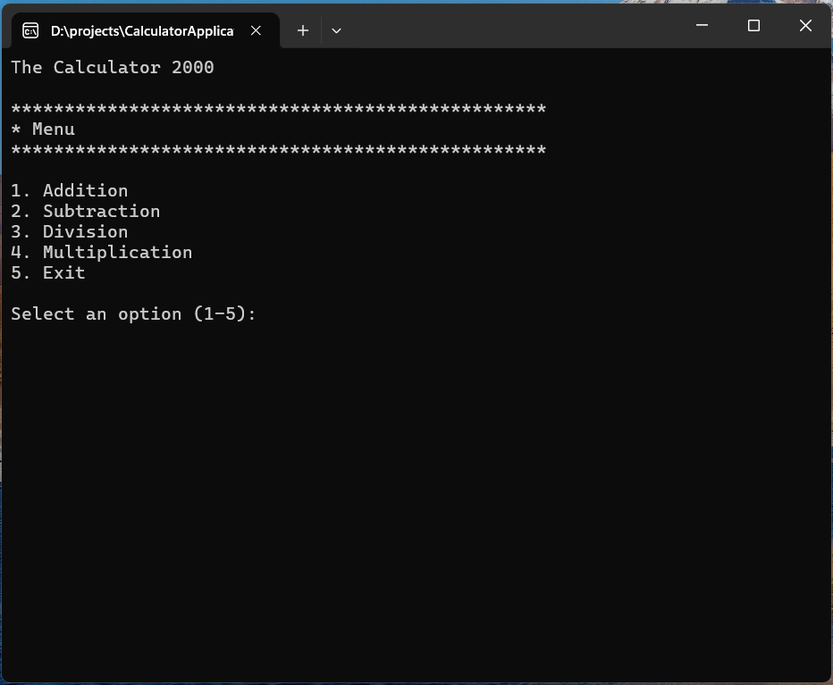
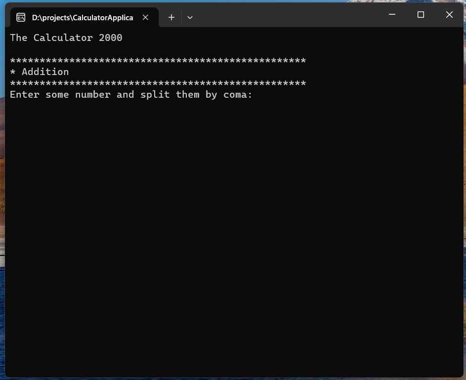
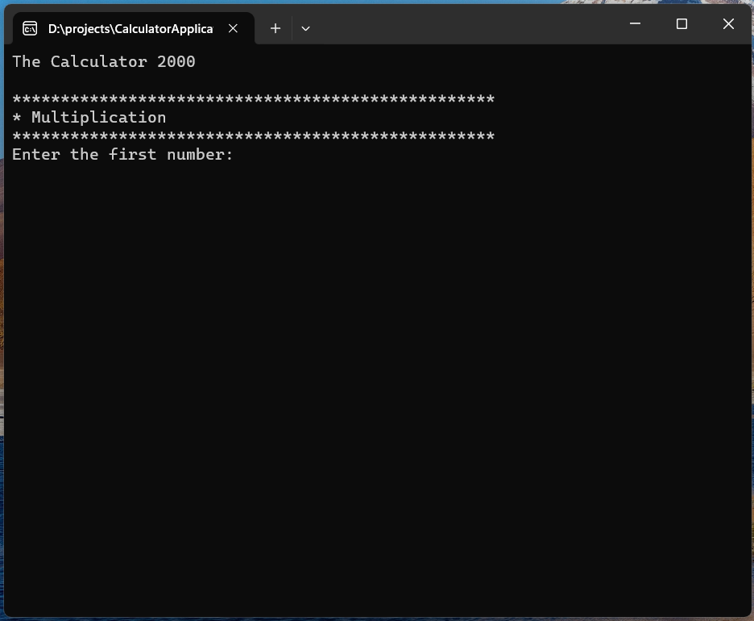

# Calculator

A simple calculator that can perform basic arithmetic operations like addition, subtraction, multiplication, and division.

## Technologies Used

- C#
- .NET 10
- Console Application
- Class library
- Basic Programming Flow
- Selection Statements
- Methods
- Iteration Statements

## Using The Calculator

1. Download the executable file from the release section of the repository.
2. When the application launches, it should look like this:

3. In the menu , select the operation you want to perform by entering the corresponding number and pressing Enter.

4. a. In example, if you want to add some numbers, select `1` for addition. then it should look like this:

	b. In example, if you want to muliply two numbers, select `4` for muliplication. then it should look like this:

## Upcoming Features

- Create a GUI for the calculator using Like WPF or WinForms.
- Add more advanced mathematical operations like exponentiation, square root, etc.